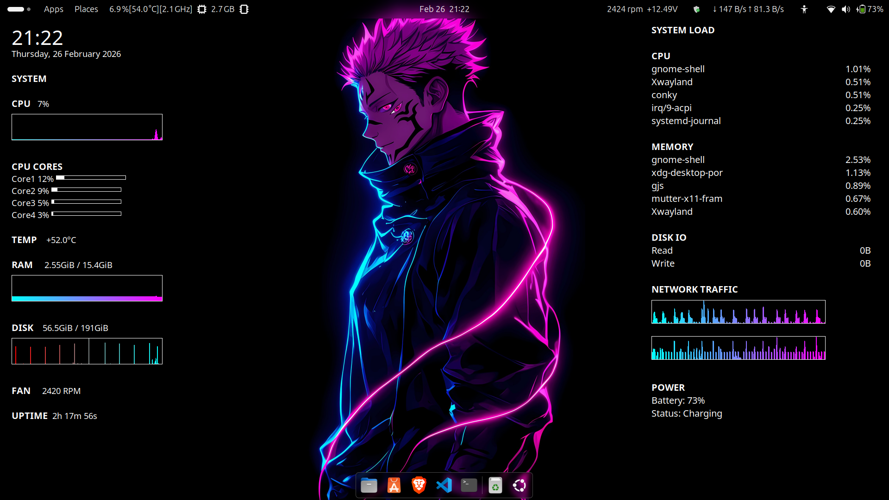

# 🚀 Conky Dashboard (1920x1080)

A clean, neon-themed Conky system monitoring dashboard designed for Ubuntu/Linux desktops.

Optimized for 1920x1080 resolution.

---

## 📸 Preview


---

## ✨ Features

### 🖥 Left Panel – System Monitor

- Digital Clock + Date
- CPU Usage Graph (history-based)
- Per-Core CPU Monitoring
- RAM Usage Graph
- Disk Usage Graph
- Temperature Monitoring
- Fan RPM
- Uptime

### 📊 Right Panel – System Load

- Top CPU Processes
- Top Memory Processes
- Disk IO Activity
- Network Traffic Graph
- Battery Status & Power Info

---

## 🛠 Requirements

This project requires:

- `conky-all`
- `lm-sensors`
- `xdotool`
- Ubuntu / Debian-based Linux

---

## 📦 Installation

### Method 1 — Automatic (Recommended)

```bash
chmod +x install.sh
./install.sh
```
---

## Manual Setup

### Install dependencies:

```bash
sudo apt update
sudo apt install conky-all lm-sensors xdotool
```

### Copy configuration files:

```bash
mkdir -p ~/.config/conky
cp left.conf ~/.config/conky/
cp right.conf ~/.config/conky/
```

- Replace network interface inside configs:

### Check your interface:

```bash
ip route
```

- Replace wlp2s0 in config files with your actual interface.

### Run manually:

```bash
conky -c ~/.config/conky/left.conf &
conky -c ~/.config/conky/right.conf &
```
---

### 🔄 Autostart

### The installer creates:

```bash
~/.config/autostart/conky-dashboard.desktop
```

```bash
[Desktop Entry]
Type=Application
Name=Conky Dashboard
Exec=sh -c "sleep 10 && conky -c $HOME/.config/conky/left.conf & conky -c $HOME/.config/conky/right.conf"
X-GNOME-Autostart-enabled=true
EOL
```

- It uses a 10-second delay to ensure GNOME loads properly before starting Conky.

---

## ⚙ Customization
### 🎨 Change Graph Colors

#### Inside config files:

```bash
${cpugraph cpu0 45,260 00FFFF FF00FF}
```
#### Format:

- START_COLOR END_COLOR

#### Example:

```bash
Cyan → Pink: 00FFFF FF00FF

Green → Red: 00FF00 FF0000
```
---

### 🌐 Change Network Interface

#### Find:

```bash
wlp2s0

```
- Replace with your interface name (e.g., enp2s0).

---

### 🔋 Change Battery Name

#### Check:

```bash
ls /sys/class/power_supply/
```

- Replace BAT0 in config files if necessary.

---

### Suitable Wallpaper:


---

### 🗑 Uninstall

```bash
rm -rf ~/.config/conky
rm ~/.config/autostart/conky-dashboard.desktop
killall conky
```
---

### 📄 License

MIT License
